# iBoot: A New Era
## Part 1: Capabilities and Objects

Big thanks to Lily ([@BendyCatus](https://twitter.com/BendyCatus)), Justin Sherman ([@jsherma100](https://twitter.com/jsherma100)), and Siguza ([@s1guza](https://twitter.com/s1guza))...

and everyone in Hack Different, love y'all :D

Dedicated to Jido Tarek. الله يرحمك.

# Contents
1. [Introduction](#1-introduction)
2. [iBoot?](#2-iboot)
3. [Finding Buggo](#3-finding-buggo)
4. [The Microkernel Dream](#4-the-microkernel-dream)  
4.1 [Capabilities?](#41-capabilities)  
4.2 [UFO - Unidentified Flying Object](#42-ufo---unidentified-flying-object)  
5. [Last Notes](#5-last-notes)


## (1) Introduction

In May of 2022, I began my research into FireBloom and how it worked. This new fancy-schmancy addition to the compiler used to build iBoot works to prevent common memory safety issues (such as buffer overflows or type confusions) when using dynamically allocated objects. I was super interested in the type safety mechanism, but I was a bit stumped on how it all worked. My frustration found me lazily scrolling over some iBoot disassembly when I came across some [recovery mode](https://www.theiphonewiki.com/wiki/Recovery_Mode) strings. I realized I'd never experimented with recovery mode, so I decided to put my device into recovery and open a shell.
After entering the recovery shell, I started typing random commands......

and after 8 commands, iBoot stopped giving me responses. Hm. Weird.

In my continued frustration, I repeatedly exited and entered the iBoot shell...and I was greeted with a pleasant surprise:

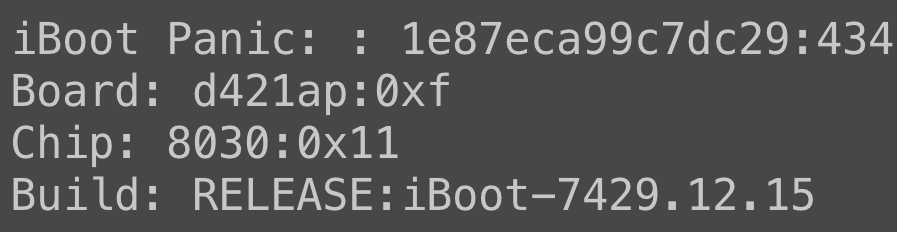

iBoot panicked! Was this really a bug? That's all it takes? What was happening exactly? Can this bug be exploited to yield full control over iBoot?

## (2) iBoot?

For the more experienced readers, feel free to skip this section. For the unfamiliar, iBoot is a piece of proprietary software called a boot loader. Essentially, a boot loader is responsible for handling and starting the lower level parts of a system. For example, a boot loader on a smartphone may turn on the display, ensure the logic board is operating at a safe voltage, turn on DRAM, among many, many other tasks. iBoot is Apple's boot loader. It runs on every piece of hardware that contains Apple Silicon chips, and it's responsible for lots of system bring-up. It evens draws a nice Apple logo on your iPhone when booting up.

Because this loader has so many tasks to accomplish, it runs before the actual iOS kernel runs, giving it lots of power. It has access to more parts of the system, and if its integrity is compromised, it may compromise the security of the user, not to mention break every guarantee that hardware measures have for the kernel at runtime. Therefore, it's almost the holy grail of iPhone hacking.

A panic is when a piece of software (typically a kernel or boot loader) resets the system state in a fresh state as a result of an unrecoverable event (like a data abort). This is usually bad for a user because it means something went wrong with your system, but great for a hacker (like myself) who wants to break a system intentionally.

(Sidenote: you cannot modify iBoot. It is both encrypted and signed, and Apple does not provide an unlocking mechanism found on other devices.)

## (3) Finding Buggo

Production builds of iBoot (mostly) do not print raw strings to the console. Instead, they are HMAC'd, or in other words, a string which is locked behind a specific cryptographic algorithm called an HMAC. This means we have no real way of knowing what the string is. It just looks like garbage numbers and letters. All I knew at this point was that iBoot was panicking, but it **did** give me an HMAC'd string, so it was time to find the HMAC in iBoot.

For anyone following along, I'll be reversing the iPhone 11 Pro's iBoot on iOS version 15.0.

`IVKEY: 5AFE47FA756A56E543AF5EEF4F9074F7E7A3038CBBD979AE7B4410A6464A4C3E6A0DCEC3FE424AEE0B32745B71860D8E`

After a quick search in Ghidra, I landed here:

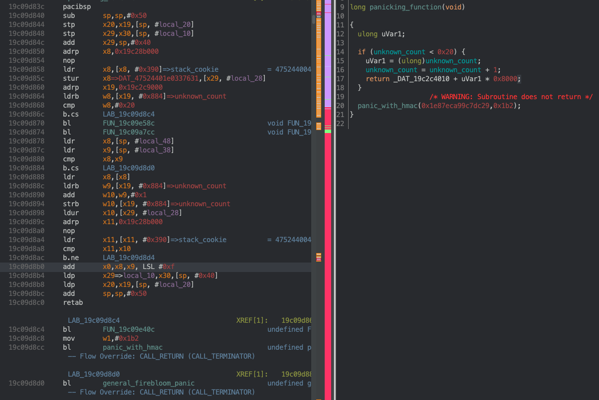

Awww, looks like a simple count check. Of course, with any panic, you should look deeper and check if there is an underlying issue. The only cross-reference to this function was `task_setup_stack`, which is called from both an initialization function called when iBoot starts up, and another function. The latter was more interesting to me because the former is only ever called when iBoot starts up. So, it couldn't be where I was panicking. After following the last XREF, I landed somewhere very interesting:

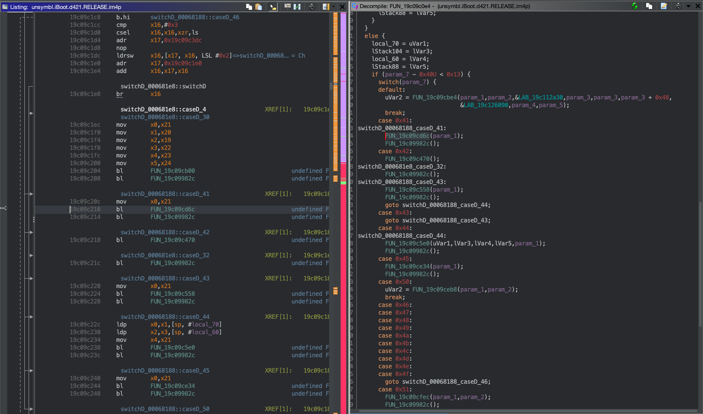

Woah, is this some sort of command handler? If you follow the only XREF you land at....a part of an exception handler?!

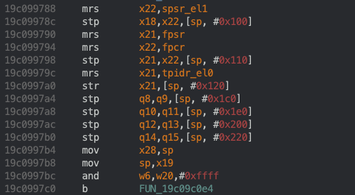

iBoot has a syscall handler! If you follow the XREF to the snippet showed above, you can see that `ESR_EL1` is stored in `x20`, which is the target of the `switch` statement. When an `svc` instruction is executed, the immediate is stored to `ESR_EL1` (with some other things). This is super cool.

If you search for a `svc 0x41`, you'll find only 1 in iBoot:

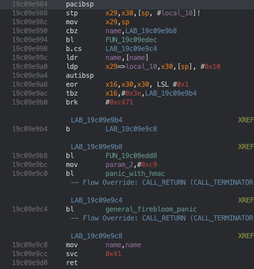

This looks like a general wrapper for the syscall, but what's more interesting is what you observe when you look at the cross references for this function:

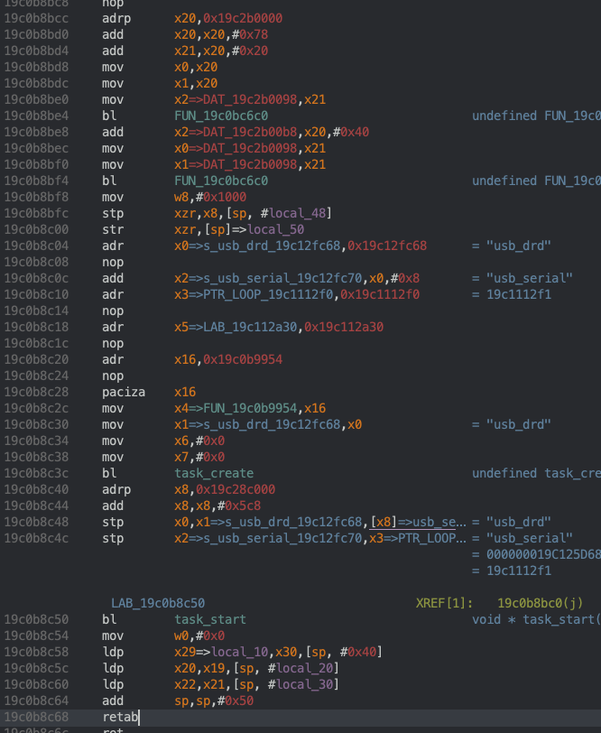

`task_start` is essentially syscall `0x41`! Super awesome. This is pretty obvious since names like "usb_serial" or "idleoff" are passed as arguments to `task_start`. This was the first hint to me that there was a kernel hiding in iBoot (along with the cheeky "Microkernel" tag in iBoot's console banner :P).

`task_start` only had a limited number of XREF's, most of which were not important because they were only called in functions that were also called once. The very last XREF was the only interesting one:

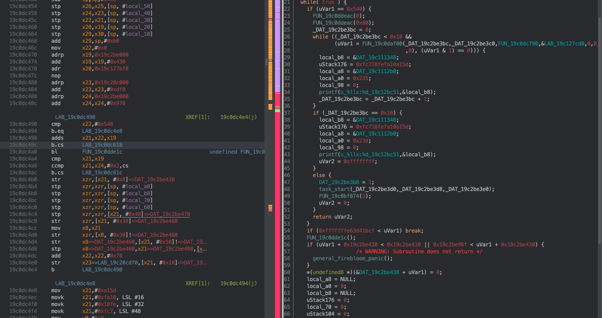

Ah, it looks like a simple error. Although the necessary conditions should eventually be reached to stop this `while` loop, it looks like ultimately `task_start` my have been getting called in excess of 0x20, which lead to the check failing and the corresponding panic.

Apple has patched this in their latest iOS 16 beta. For anyone who needs the key, enjoy: `047CAED3912AFB8B647F7B1743B56034E6C5EF2624C8282F6E073B11E1DEF06E548EA3298872C61D3B994E1C8ACABC62`
*Source: https://twitter.com/matteyeux/status/1535138636273963008*

And here's the patch:

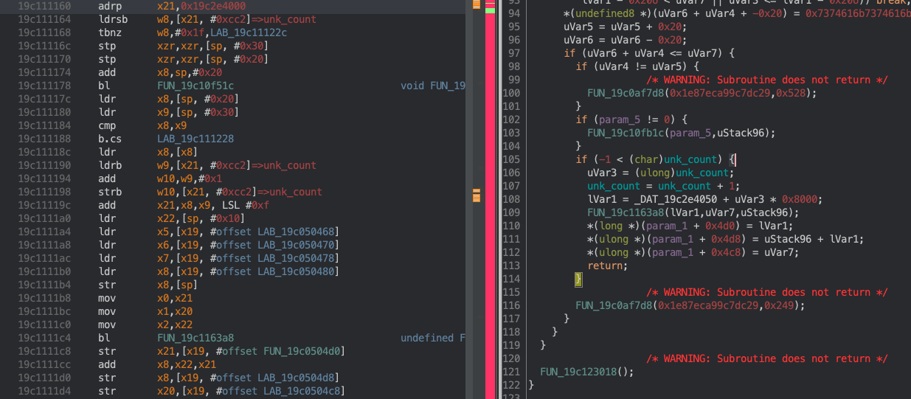

From what I can tell from the call stack, the old assembly, and the patch, `0x20` seems to be an accidental, arbitrary limit that was set for some resource that's allocated per-task. If so, the new patch makes sense because there should (technically speaking) be no limit for the amount of tasks in a kernel. All this patch does is allow the count to be incremented until it overflows.

At this point, I was pretty disappointed. This did not lead to a very useful bug. On the flip side, I was eager to jump back into reverse engineering the kernel I thought existed in iBoot. A little spoiler to the reader: all of this is the tip of the iceberg. iBoot has significantly changed, and we're in a new era. Gone are the days of the tiny iBoot task subsystem. Welcome to "the Dream".

## (4) The Microkernel Dream
*https://twitter.com/tjkr0wn/status/1535005157947326464?s=20&t=2d26FvCHltl7wQP9rvQq-Q*

One of my favorite ways to reverse engineer a new component is to compare the startup routines of the same binary. In this instance, I went through and compared the startup routines of iBoot before and after this supposed kernel was added. When comparing the 15.0 iBoot to a 14.X iBoot, I noticed an important difference. The startup routine jumps to an unfamiliar function. Previously, iBoot went through this flow: `_start(...) -> _main(...)`. However, this iBoot had a new flow `_start(...) -> _intermediate(...) -> _new_main?(...)`:

*`_main(...)` in 14.X*
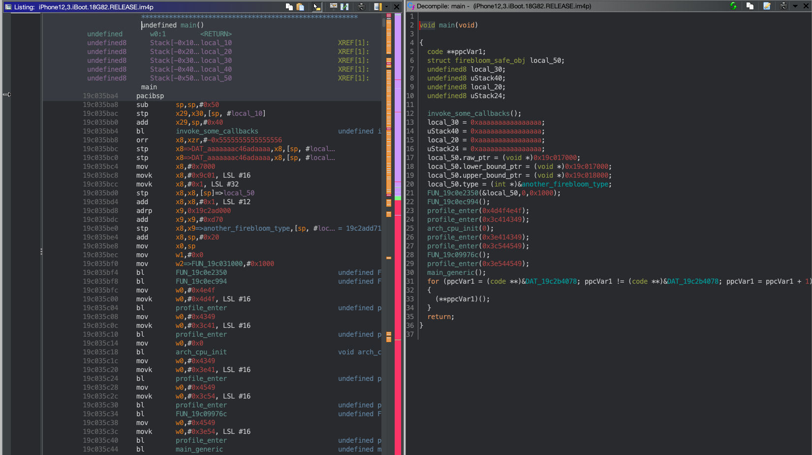

*`_intermediate(...)` in 15.X*
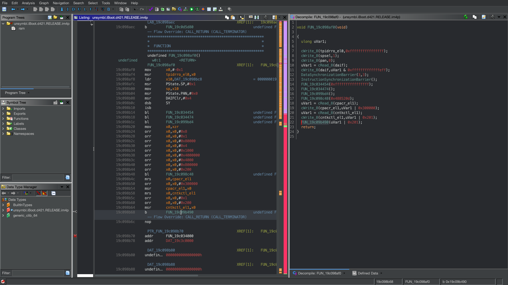

*`_new_main?(...)` in 15.X*
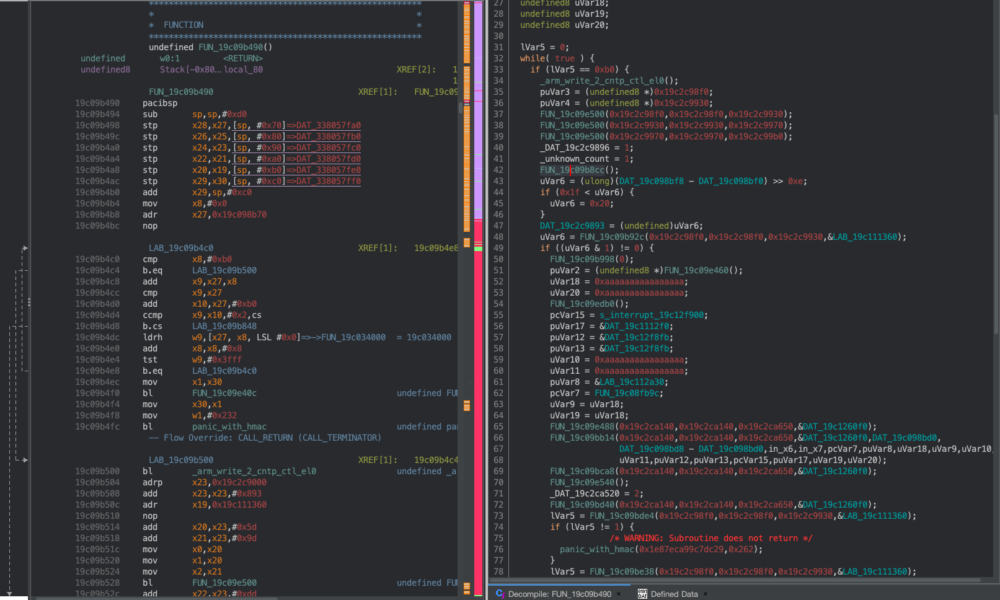

These `_main(...)`'s looked quite different from each other. In fact, not even the `main_generic(...)` found in the 14.X iBoot looked similar to 15.0's `_new_main?(...)`, so what gives?

A large amount of code like this may seem daunting, but nobody is familiar with any piece of code as soon as they look at it, so I began just clicking around and seeing what this completely new function does. Well, as it turns out, this is not a "new version of main(...)", but rather `microkernel_init(...)`. It does a lot of the initialization for important things the microkernel needs to run and operate.
I quickly discovered something interesting in a function that is called within the new `microkernel_init(...)`:

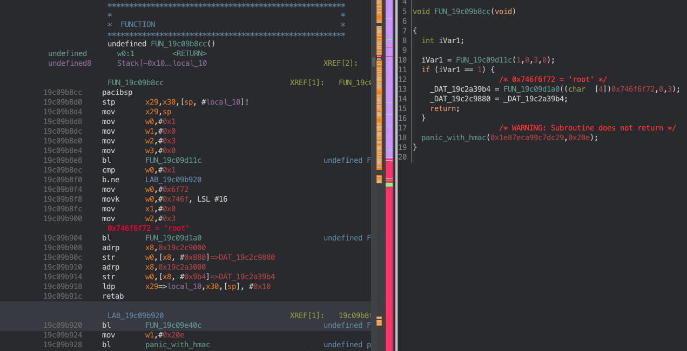
*Figure 1*

### (4.1) Capabilities?

Hm, looks like this code might be creating a 'root' process and setting a global pointer to the returned task pointer. But, it's probably better to keep going and not draw conclusions yet. What about the function call above? It seems to have some basic arguments, and it looks essential to initialization, so let's look further:

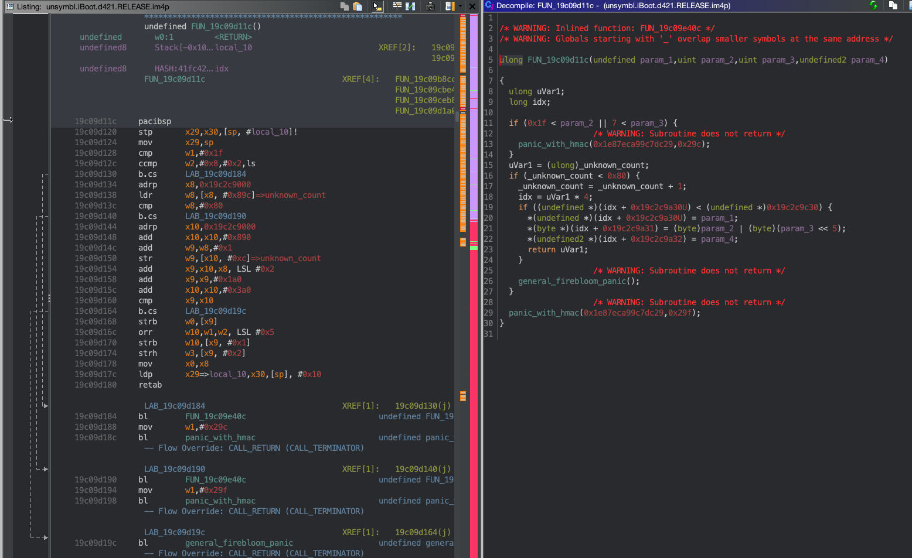
*Figure 2*

Looks like a list of bytes (notice the `strb` instructions, except the `strh`) that are created from the arguments passed in. This list seems to be maintained with a count that's incremented after every invocation. This count also starts at 1 because it is set to 1 before the function in Figure 1 is ever invoked. Note: after this function finishes execution, `_unknown_count = 2`. I kept an eye out for the address `0x19c2c9a30`, and the others in this screenshot...

When I hopped back to the supposed 'root task' function seen in Figure 1, I found a call to a function at `0x19c09d3a4` that uses the address(es) above:

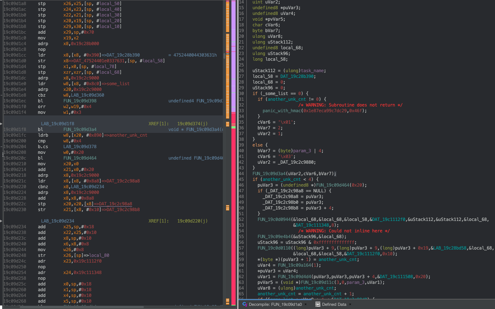
*Figure 3*

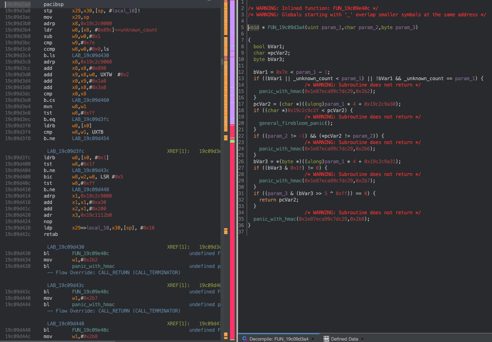
*Figure 4*

Let's go back to Figure 2. If we work through what the first values of this list are, we find this:

```c
uint8_t *unknown_list = (uint8_t *)0x19c2c9a34; // idx = 1 * 4 because _unknown_count = 1 before the function executes
...
*(unknown_list) = 0x1;
*(unknown_list + 1) = (uint8_t) 0 | (uint8_t) (3 << 5);
*((uint16_t *)(unknown_list + 2)) = 0;

/*
0x19c2c9a34 : 0x1
0x19c2c9a35 : 0x60
0x19c2c9a36 : 0x0
*/
```

Looking at Figure 3, the values likely passed to `FUN_19c09d3a4` on startup are `FUN_19c09d3a4(1, 1, 2)` because the global variables in the `if` conditional would be 0. Now, looking at the assembly in Figure 4, we can work through the logic with the supposed arguments and the values in the `unknown_list`:

```c
// param_1 = 1
// param_2 = 1
// param_3 = 2

bool bVar1 = 0x7e < param_1 - 1; // bVar1 = false;
if ((bVar1 || _unknown_count < param_1) || !bVar1 && _unknown_count == param_1) { // _unknown_count = 2
  panic_with_hmac(0x1e87eca99c7dc29, 0x2b2);
}

char *pcVar2 = (char *)(param_1 * 4 + 0x19c2c9a30); // pcVar2 = 0x19c2c9a34;
if ((char *)0x19c2c9c2f < pcVar2) {
  general_firebloom_panic();
}

if ((param_2 != -1) && (*pcVar2 != param_2)) { // *pcVar2 = 0x1;
  panic_with_hmac(0x1e87eca99c7dc29, 0x2b6);
}

bVar3 = *(byte *)(param_1 * 4 + 0x19c2c9a31); // param_1 = 1

if ((bVar3 & 0x1f) != 0) { // bVar3 = 0x60, 0x60 & 0x1f == 0
  panic_with_hmac(0x1e87eca99c7dc29, 0x2b7);
}

if ((param_3 & (bVar3 >> 5 ^ 0xff)) == 0) { // (2 & (0x60 >> 5 ^ 0xff)) = 0
  return pcVar2;
}

panic_with_hmac(0x1e87eca99c7dc29, 0x2b8);
```

Hm. This looks likes some sort of permissions/capabilities list. Not only is there a list of these capabilities, but these capabilities also seem to be checked in multiple places. This function also returns the base of this capability. Although I didn't exactly know how these fields differentiate, I put together a  definition for capabilities:
```c
typedef struct _capability {
  uint8_t c_unk_1;
  uint8_t c_unk_2;
  uint16_t c_unk_3;
} capability_t;
```
...but more on this as we keep going.

`FUN_19c09a164` has a `printf("%s: xxx ...", __func__, ...)`, but the string has not been ifdef'd out or HMAC'd out: "microkernel_mmu_tt_alloc: L%u start L%...". Nice! Now we know what this particular function does and what the naming convention of this new kernel is. One interesting thing to think about is how a translation table is getting allocated per-process, but more on that later as well.

Now, let's establish some new names:

```python
FUN_19c09d11c = microkernel_capability_create
FUN_19c09d3a4 = microkernel_capability_check
FUN_19c09d1a0 = microkernel_process_create
FUN_19c09a164 = microkernel_mmu_tt_alloc

_unknown_count = _capability_count
_some_list = _process_list
another_unk_count = process_count
```

### (4.2) UFO - Unidentified Flying Object

If there are capabilities per-process/task, I'd expect some related code to be found where the process is created or started. Let's take a look at `task_start`:

```c++
void *task_start(task_t *task, void *param_2, void *param_3):
    0x19c09e984      pacibsp
    0x19c09e988      stp x29, x30, [sp, -0x10]!
    0x19c09e98c      mov x29, sp
    0x19c09e990      cbz x0, 0x19c09e9b8
    0x19c09e994      bl 0x19c09edec //INLINED FUNCTION
    0x19c09e998      b.hs 0x19c09e9c4
    0x19c09e99c      ldr w0,[x0]               ; 0xd8 ; 216
    0x19c09e9a0      ldp x29, x30, [sp], 0x10
    0x19c09e9a4      autibsp       //VERIFY_LR START
    0x19c09e9a8      eor x16, x30, x30, lsl 1
    0x19c09e9ac      tbz x16, 0x3e, 0x19c09e9b4
    0x19c09e9b0      brk 0xc471    //VERIFY_LR END
    0x19c09e9b4      b 0x19c09e9c8
    0x19c09e9b8      bl get_hmaced_path
    0x19c09e9bc      mov w1, 0xc9
    0x19c09e9c0      bl panic_with_hmac
    0x19c09e9c4      bl general_firebloom_panic
    0x19c09e9c8      mov w0, w0
    0x19c09e9cc      svc 0x41      //SYSCALL HERE
    0x19c09e9d0      ret
```

Looks like not much is happening except some FireBloom checks and a link register verification. As I said before `task_start` is just a general wrapper for syscall `0x41`, so I went back to the microkernel's syscall handler and took a look at the case for `0x41`.
###### Note that syscall arguments are given in a similar way to how function arguments are passed through in the standard ABI

```c++
switch_::case_0x41
0x19c09c20c      mov x0, x21
0x19c09c210      bl FUN_19c09cd6c
0x19c09c214      bl microkernel_jump_to_task //MORE ON THIS SOON
```

And below is the decompilation for `FUN_19c09cd6c`:

```c
void FUN_19c09cd6c(undefined8 param_1, undefined8 param_2, void *param_3, undefined8 param_4)
{
  void *pvVar1;

  pvVar1 = FUN_19c09e1bc(param_1, 2);
  if (pvVar1 == (void *)0x19c2ca140 || pvVar1 == (void *)0x19c2c9c30)
    panic_with_hmac(0x1e87eca99c7dc29, 0x3ac);

  if (pvVar1 < in_x1 || param_3 <= pvVar1)
    general_firebloom_panic();

  if (*(int *)((long)pvVar1 + 0x3e0) != 1 && *(int *)((long)pvVar1 + 0x3e0) != 7)
    panic_with_hmac(0x1e87eca99c7dc29,0x3ad);

  FUN_19c09bb14(pvVar1, 0x2, param_3);
  FUN_19c09bca8(pvVar1, 0x2, param_3, param_4);

  *(undefined4 *)((long)pvVar1 + 0x3e0) = 2;

  _VERIFY_LR();

  FUN_19c09db08(pvVar1, 0x2, param_3, param_4);
  return;
}

```
*Figure 5*


And the decompilation for the first function (FUN_19c09e1bc) call in Figure 5:

```c
void * FUN_19c09e1bc(uint32_t param_1, uint64_t param_2)
{
  capability_t *capability;

  capability = microkernel_capability_check(param_1, 0x2, param_2);

  const void *capabilities_base = (void *) 0x19c2c9a30;
  const void *capabilities_max_bound = (void *) 0x19c2c9c30;

  if (capability < capabilities_base || capabilities_max_bound <= capability)
    general_firebloom_panic();

  _VERIFY_LR(); //Has to be done because there's no link when branching below (in assembly)

  return FUN_19c09e1fc(capability->c_unk_3);
}
/*
Note: the above decompilation is done by hand. `microkernel_capability_check` does some funky
things in the return block. It gives the capability list bounds in x1 and x2, so I had
to crunch the assembly manually, but there's nothing wrong with that! I encourage everyone
reading to sift through some assembly too.
*/
```
*Figure 6*

If you go back to `task_start`, you'll notice that the pointer in `x0` (which came from `task_create`) is dereferenced with the result going into `w0` before the syscall. This means that the first 4 bytes of the returned task structure is now an index into the global capabilities list. Let's continue on...

If I'm trying to understand what a certain field in a structure is, I always try to see how and where it is used. In the decompilation snippet above, `c_unk_3` is passed as an argument to a new function, so perhaps it's useful to look at what it does with the argument.

```c++
  0x19c09e1fc      7f2303d5       pacibsp
  0x19c09e200      fd7bbfa9       stp x29, x30, [sp, -0x10]!
  0x19c09e204      fd030091       mov x29, sp
  0x19c09e208      01a28052       mov w1, 0x510
  0x19c09e20c      f4fcff97       bl 0x19c09d5dc // <--|
  0x19c09e210      fd7bc1a8       ldp x29, x30, [sp], 0x10
  0x19c09e214      ff2303d5       autibsp
  0x19c09e218      d0071eca       eor x16, x30, x30, lsl 1
  0x19c09e21c      5000f0b6       tbz x16, 0x3e, 0x19c09e224
  0x19c09e220      208e38d4       brk 0xc471
  0x19c09e224      74000014       b 0x19c09e3f4
```

Sigh. Looks like I have to reverse this function first before we can move on:

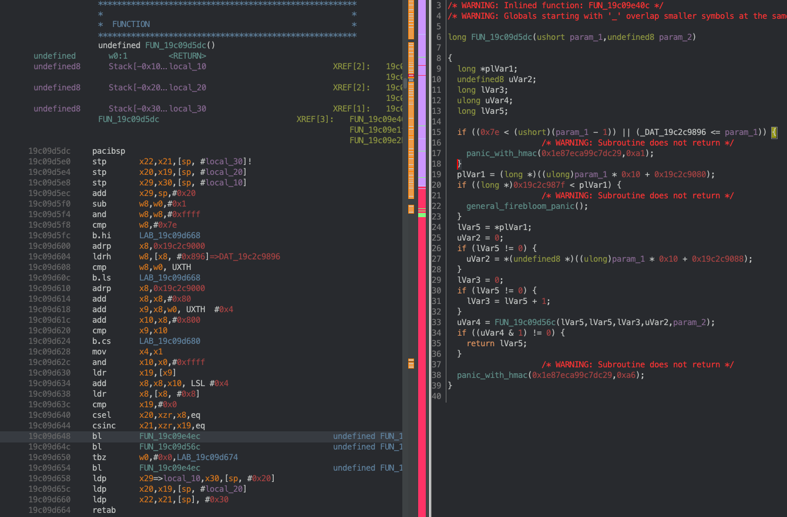

Hm. It looks pretty similar to the capability system. There's a bound of `0x7e`, and there also seems
to be another list. After cleaning this decompilation up, I ended up with this:

```c
bool microkernel_object_check(uintptr_t unk_object)

{
  bool bVar1;

  bVar1 = false;

  if ((unk_object != 0) && (in_x4 != 0)) {

    // INLINED FUN_19c09b300 START

    //NOTE: in_x4 in this context would be `0x510`
    if (add_overflow(unk_object, in_x4))
      panic_with_hmac(0x1e87eca99c7dc29,0x62);

    bVar1 = 0x19c2c3fff < unk_object && unk_object + in_x4 < 0x19c2ca651;

    // INLINED FUN_19c09b300 END

    bVar1 = (unk_object & 0xf) == 0 & bVar1;
  }
  return bVar1;
}
```

```c
//NOTE: unk_object is returned in both x0 and x1 while x3 and x4 are set before returning as well
void * microkernel_object_get(uint16_t idx, uint32_t param_2)

{
  void **ppvVar1;
  void *unk_object;

  if ((0x7e < idx - 1 || (*((uint16_t *)0x19c2c9896) <= idx))
    panic_with_hmac(0x1e87eca99c7dc29,0xa1);

  ppvVar1 = (void **)(idx * 0x10 + 0x19c2c9080);

  if ((void **)0x19c2c987f < ppvVar1)
    general_firebloom_panic();

  unk_object = *ppvVar1;

  in_x3_returned = NULL;
  if (unk_object != NULL)
    in_x3_returned = *(undefined8 *)(idx * 0x10 + 0x19c2c9088);

  in_x2_returned = NULL;
  if (unk_object != NULL)
    in_x2_returned = (uint64_t)unk_object + 1;

  //NOTE: This function uses x4, but I'd rather not include it in the arguments since x1-x3 aren't touched
  if (microkernel_object_check(unk_object))
    return unk_object;

  panic_with_hmac(0x1e87eca99c7dc29, 0xa6);
}
```

```c
void microkernel_object_get_and_cast(uint16_t idx) /* AKA: FUN_19c09e1fc */
{
  void *unk_object = NULL;

  unk_object = microkernel_object_get(idx, 0x510);

  _VERIFY_LR();

  return firebloom_XXX(unk_object, unk_object, x2, x3, 0x19c1260f0);
}
```

I have to be honest: I could not definitively figure out what this FireBloom function does. Feel free to (attempt) to reverse engineer it. I've tried for many hours. However, since FireBloom stuff will appear around all structures and objects, I don't think it's too important to understand for this writeup.
All I can deduce is that there is code checking how many pointers the object holds and whether or not it is primitive. My best guess as to what this function does is type checking and casting.

At this point, I had to step back and think about what I know so far about this weird microkernel object stuff:

1. There are fetches from both `0x19c2c9080` and `0x19c2c9088` with indexes of 0x10. This means that there's a structure of size 0x10, and there is a list of multiple of these structures.  We can name the base of the object list `microkernel_objects_list`.

2. The first member of this structure is a pointer. This is obvious because `unk_object` is treated like a pointer in `microkernel_object_check`. The bottom 4 bits of this pointer also have to be 0 in order to avoid a panic.  

3. `unk_object` + 1 is put into `x2`, and the FireBloom routine uses it. If you have read [Saar Amar's blog on FireBloom types](https://saaramar.github.io/iBoot_firebloom_type_desc/), or even looked at types in a disassembler, you'll know that most types' first 8 bytes are the addresses of the type + 1. These two things coupled together leads me to believe that these `unk_object`s are FireBloom types. However, we haven't verified this claim yet, so in the structure definition below, both fields are `unk`'s.

Although this little hiatus created more questions, it answered the main one I had! `c_unk_3` is an index into this microkernel object list.

```c
typedef struct _capability {
  uint8_t c_unk_1;
  uint8_t c_unk_2;
  uint16_t kernel_object_index;
} capability_t;
```

And here's a nice definition for the object for now:

```c
typedef struct _microkernel_object {
  void *unk_1;
  void *unk_2;
} microkernel_object_t;
```

When I reversed this function, I thought that looking for a corresponding `microkernel_object_store` would perhaps help me better understand what these objects might be. After looking for the base address of the object list, I quickly found the function I was looking for:

```c
uint32_t microkernel_object_store(ulong param_1, ulong param_2, ulong param_3, undefined8 param_4)
//AKA FUN_19c09d4d4
{
  microkernel_object_t *object;
  uint32_t cnt;
  const void *object_max_bound = (void *) 0x19c2c9880;

  //WARNING: Uses x4!
  if (!microkernel_object_check(param_1))
    panic_with_hmac(0x1e87eca99c7dc29, 0x8e);

  cnt = _object_cnt; //<-- Global count of microkernel objects
  if (cnt < 0x80) {
    _object_cnt++;
    object = &microkernel_objects_list[cnt]; //microkernel_object_t *microkernel_objects_list

    if (object < object_max_bound) {
      if (param_3 <= param_1 || param_1 < param_2) {
        param_1 = 0;
      }

      object->unk_1 = param_1;
      object->unk_2 = param_4;

      return cnt;
    }

    general_firebloom_panic();
  }

  panic_with_hmac(0x1e87eca99c7dc29, 0x91);
}
```

And after looking at the cross-references (```0x19c09d4cc, 0x19c09e1b4, 0x19c09e2b4```), I noticed something interesting. There are only three, and each one does something similar:

```c++
  04098052       mov w4, 0xXX //<-- Different immediate in each
  87fcff17       b microkernel_object_store
```

The three immediates I saw were `0x510`, `0x48`, and `0x20`.

What's even cooler is what I observed when looking at the XREF to the `0x20` wrapper:

```c
//Cleaned decomp from FUN_19c09d1a0
puVar3 = (undefined8 *)microkernel_alloc(0x20);
...
*(byte *)(puVar3 + 1) = proc_count;
uVar4 = microkernel_mmu_tt_alloc(1);
*puVar3 = uVar4;
uVar1 = microkernel_store_object_0x20_wrapper(puVar3, puVar3, (puVar3 + 4), &FireBloom_type_19c111508);
//NOTE: Discovering `microkernel_alloc` is beyond the scope of this writeup, I'll save you the pain :P
```

Alright now we have an idea of what these objects are! Here's the revised struct definition:

```c
typedef struct _microkernel_object {
  void *alloced_obj;
  firebloom_type_t *type;
} microkernel_object_t;
```

And the new decompilation for Figure 6:

```c
void * microkernel_object_for_capability(uint32_t param_1, uint64_t param_2)
{
  capability_t *capability;

  capability = microkernel_capability_check(param_1, 0x2, param_2);

  const void *capabilities_base = (void *) 0x19c2c9a30;
  const void *capabilities_max_bound = (void *) 0x19c2c9c30;

  if (capability < capabilities_base || capabilities_max_bound <= capability)
    general_firebloom_panic();

  _VERIFY_LR();

  return microkernel_object_get_and_cast(capability->kernel_object_index);
}
```

The overflow check in `microkernel_object_check` also makes sense now! It's simply checking that the chunk received from `microkernel_alloc` does not overflow some set bounds.

The reason for the earlier FireBloom routine being so complex could be that extensive checks are needed to ensure that, when the `alloced_obj` is casted to its corresponding `type`, nothing goes wrong. Perhaps casting a non-primitive `void *` to a FireBloom type isn't as simple as other casting operations. That would explain quite a bit.

A question that still lingers is what the `alloced_obj` could represent, and it can technically represent 3 different things since there are 3 different sizes used in each wrapper, but anyone with a keen eye can figure out what the `0x510` represents ;P. More on that in the next part.

### (5) Last Notes

We learned lots!

At this point, you might still have lots of questions. I hope to answer these in the coming parts of this writeup. If not, just reach out to me. The first part of this writeup's purpose is to shed some light on what this microkernel is, and what a lot of it looks like. Most concepts in this first part were briefly introduced to either set up for the upcoming parts, or to encourage you, the reader, to dig in and learn a bit more yourself. I hope, either way, I have brought just a morsel of knowledge to someone or even gave them something enjoyable to read. Cheers!


With lots of love (and assembly),

Tarek Joumaa - tjkr0wn
